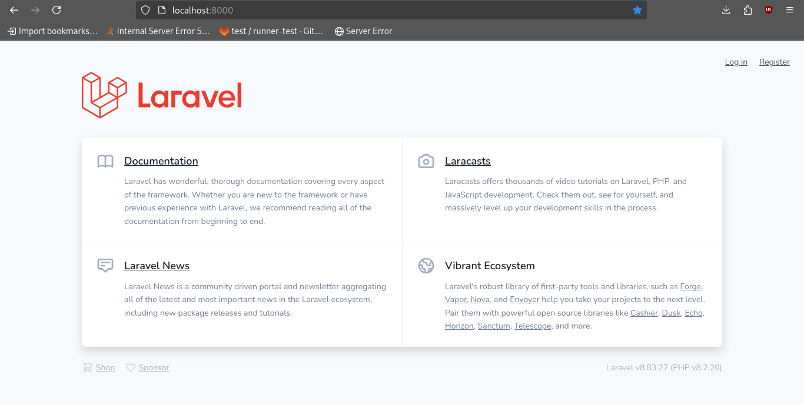

Tuesday 13 August 2024

# [Lara well](https://upload.wikimedia.org/wikipedia/en/f/f1/TombRaider2013.jpg)

I started the day by creating the first laravel application. I followed [THIS](https://laravel.com/docs/11.x/installation) guide.

```bash

composer global require laravel/installer
 
laravel new example-app

```

Then i ran it using:

```bash
cd example-app
 
php artisan serve
```

And i was greeted with this screen:





## Exploring the Application Structure:

I spent some time exploring the folder structure of the newly created Laravel project. I found the routes/web.php file where the web routes are defined. This file is essential for setting up the routes that users will interact with.

## Modifying the Welcome Page:

I updated the resources/views/welcome.blade.php file to display a custom message. I changed the content to say, "Welcome to My Laravel Application," and added some basic styling to give it a personal touch.

## Setting Up Environment Configuration:
I edited the .env file to configure the application environment. I set up the database connection parameters to prepare for future development. I used SQLite for simplicity in this initial phase:


```env
    DB_CONNECTION=sqlite
    DB_DATABASE=/path_to_your_database/database.sqlite
```


## Running Artisan Commands:

To get a feel for Laravel's command-line interface, I ran several Artisan commands. For instance:

```bash
php artisan list
php artisan help
```


These commands provided an overview of available Artisan commands and their usages. I also used php artisan make:controller to create a basic controller:

```bash
    php artisan make:controller SampleController
```


## Creating a Simple CRUD Interface:

I decided to build a basic CRUD (Create, Read, Update, Delete) interface to get hands-on experience with Laravel’s core features. I started by creating a migration for a new posts table using:

```bash
php artisan make:migration create_posts_table
```


I then defined the schema in the migration file located in database/migrations and ran the migration with:

```bash
    php artisan migrate
```


## Setting Up Models and Controllers:

After creating the migration, I generated a model for the Post entity:

```bash
php artisan make:model Post
```


I also created a controller to handle CRUD operations for posts:

```bash

    php artisan make:controller PostController
```


I began wiring up basic CRUD operations in the PostController, including methods for creating, storing, editing, updating, and deleting posts.


## Building Views:

To interact with the posts, I crafted simple Blade templates for creating and listing posts. I placed these views in resources/views/posts and used Laravel’s Blade templating features to render the data.


