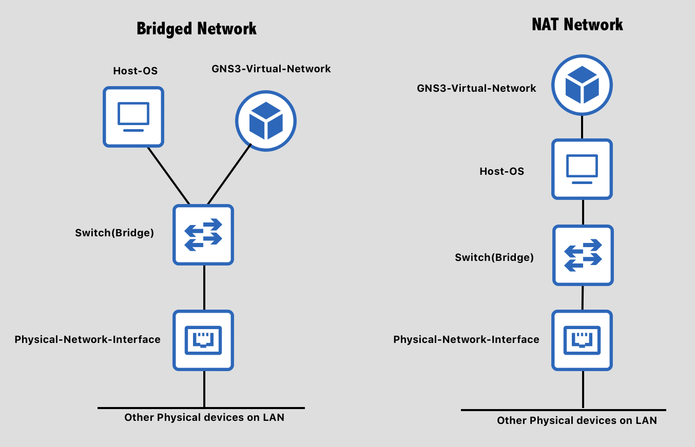
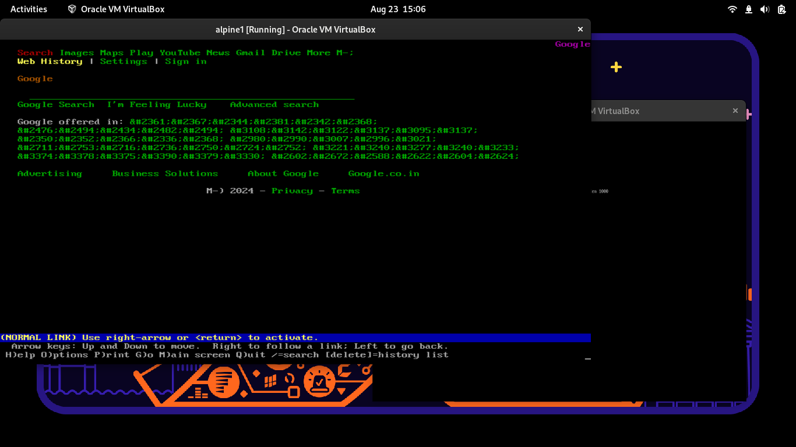

Friday 23 August 2024

# Network bandwidth usage monitoring.

My next task was to monitor the network bandwidth usage on the whole network. Since the internet would be routed through a firewall, we would have to note the bandwidth usage on it. Before doing anything we would have to simulate a firewall.

A firewall is basically a linux machine running some tools. Since we are just simulating, it does not need to be an actual firewall, any device running linux and able to capture network traffic would do, in my case my own laptop.

To simulate multiple machines, i used 2 virtual machines i created earlier, running alpine linux.


# DHCP discover issues.

So first task was to set those both devices back from NAT to bridge.
Here's the basic difference between NAT and Bridge:




I set up the networking mode from NAT to Bridge in my virtual machine however, it was not able to get the IP address from the router.

My first thought was, it might be that i was using wifi, and it might not be able to simulate a virtual port (which is basically what bridge network would do in my case)

So i switched to using an ethernet cable, but that did not work out. So the issue might be something else.

I read how DHCP works in the book "Computer Networking by Andrew Tanebaum", and it told me that the system first sends dhcpdiscover probe from the device to 255.255.255.255, that means it sends a probe in the network broadcast to discover the DHCP server.

Once the DHCP server discovers the probe, it replies to the network device requesting an IP, and does the IP assignment business.

To debug my theory, i did this:

```bash
sudo tcpdump -i enp2s0 port 67
```


enp2s0 was my network interface, port 67 and 68 is used by DHCP, this would capture all the broadcast requests made to that port in the network.

Then i ran the `udhcpc` on the virtual machine, and to my surprise, i did recieve the DHCP probe on my main machine. Thought to myself that might be because they are virtually the same port, it might be possible it might not be getting past that, so i tested it on another PC on the same network, it also did discover the DHCP probe sent by my device.

The way i identified which device it was by its mac address.

Anyhow, the issue was not on my side at all, turns out the IP lease given by the DHCP server was full and no more IP addresses were left.

does that mean we will create a new subnet?? NO! i just ran an ARP scan and looked for the IPs which were unused, turned out to be 10.1.1.68.

So i assigned that IP address statically to my VM by editing the `/etc/network/interfaces` file using my favourite text editor nano (not vim, nor emacs)

Here's that file:

```
auto lo
iface lo inet loopback

auto eth0
iface eth0 inet static
	address 10.1.1.68
	netmask 255.255.255.0
	gateway 10.1.1.69
```

Notice the gateway is 10.1.1.69, different from the usual 10.1.1.5 which it should be, we will talk about it next.


# Changing the gateaway to my system.

Since we are looking to simulate a firewall, we would also be providing the internet to that system, since thats how we would know how much traffic is going through it.

for that we need:

- DNS
- Our system to act as a gateway to the internet for other devices.

I had already installed a private DNS earlier, so i just used that. I put the upstream to 10.1.1.5.
Regarding the gateway, i used iptable rules to act as a gateway. this is how it was done:

```bash
iptables -t nat -A POSTROUTING -o wlp3s0 -j MASQUERADE	#> This would change the IP addresses exiting to my machine. 
iptables -A FORWARD -i wlp3s0 -o wlp3s0 -j ACCEPT	#> Used to indicate we would accept and forward all the packets coming through the same interface.
iptables -A FORWARD -i wlp3s0 -o wlp3s0 -m state --state RELATED,ESTABLISHED -j ACCEPT

```


This converts my laptop to a gateway, for other devices (my VM alpine1 and alpine2)


# Testing  if the internet works.

I fired up wireshark on my laptop, and selected all interfaces. In the filter i put HTTP to monitor all the HTTP(s) traffic going through it.

I had already downloaded lynx (a commandline browser) on my system, since i had no GUI in virtual machine (to save resoureces)

I visited google.com, and it worked.

# SUCCESS.


