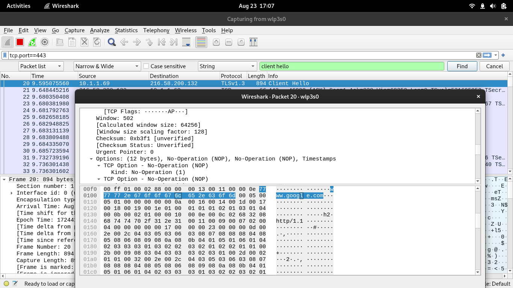

Monday 26 August 2024

~ Defeating the Dns over HTTPS, one ClientHello at a time

# Network Traffic analysis per website, network wide.

So the task sounds very simple on surface, to get how much data each website uses. It is actually very easy on a single device, but on an enterprise, sometimes installing a network monitoring software on each system is not possible, due to varying operating systems, ability for people to remove it and general trouble of getting the software on each system, not every enterprise can afford to do so.

However some enterprises might want to monitor which website is most visited, and there's no simple tool for that.

Many of the tools claim to do so but fundamentally, it would not be possible since mostly they'd rely on the DNS queries to find out which website is being visited, since one IP can have multiple websites hosted. 

However we do have one way to know which website is being visited, by intercepting the ClientHello messages.

A client hello message is what a client sends to a server before the handshake can occur. This ClientHello is unencrypted. Newer standards are developing, but they're not the de-facto just yet and area in their infancy. a VERY FEW websites use them, such as ECH.

Anyhow, as previously seen:

# Implementing it in C++ from scrach

What we need is very simple, something which just does 2 tasks:

- Detect what site is being visited
- Log how much data it used

We should not be downloading gigabytes of programs to do so, that would be very unwise and might bring an overhead on our tiny firewall worth 1 GB of ram.

I decided C++ because it is the fastest of all the alternatives.

[Here's the Basic prototype of capturing client hello](https://raw.githubusercontent.com/amrinder-cs/ClientHello-Capture/701a619b80532af8168a2dade6580ddd6c528131/capture.cpp)

This simply does what wireshark does, but it takes much less resources, less than a megabyte of ram really.
