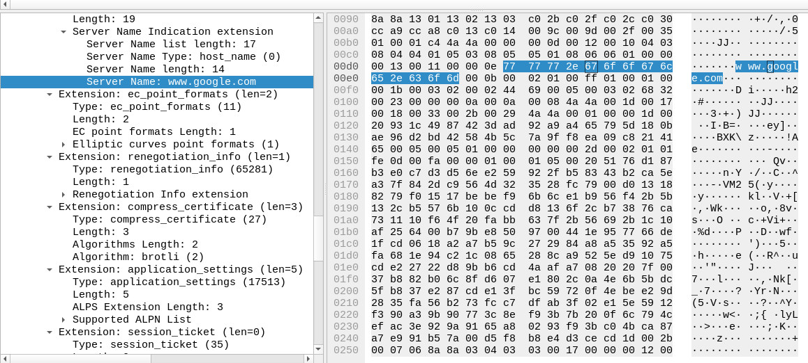

Tuesday 27 August 2024

# Getting the server name from the TCP ClientHello packets

We need to get the servername from the packet, because we need this information for logging:

- source IP
- hostname of target
- bytes sent
- bytes recieved

To get this information, we need to process the packet first.

The formatting was inferred from wireshark. Once we got all the bits we compared them to the bits in wireshark, and bit by bit we parsed it.

It was a laborous task so we took some help from our robot friends, anyhow this is what the hex bytes mean:





This code gave us the server name:

<details>
<summary>Click to expand code</summary>


```cpp
void parse_client_hello(const u_char *tls_data, size_t length) {
    size_t offset = 0;

    // TLS Record Header
    if (length < 5) {
        std::cout << "Not enough data for TLS Record Header" << std::endl;
        return;
    }

    // Content Type
    u_char content_type = tls_data[offset];
    std::cout << "Content Type: 0x" << std::hex << static_cast<int>(content_type) << std::dec << std::endl;
    offset += 1;

    // Version
    if (length < 7) {
        std::cout << "Not enough data for TLS Version" << std::endl;
        return;
    }
    u_short version = ntohs(*(u_short*)(tls_data + offset));
    std::cout << "Version: TLS " << ((version >> 8) & 0xFF) << "." << (version & 0xFF) << std::endl;
    offset += 2;

    // Length
    if (length < offset + 2) {
        std::cout << "Not enough data for Length" << std::endl;
        return;
    }
    u_short length_value = ntohs(*(u_short*)(tls_data + offset));
    std::cout << "Length: " << length_value << " bytes" << std::endl;
    offset += 2;

    // Handshake Header
    if (length < offset + 4) {
        std::cout << "Not enough data for Handshake Header" << std::endl;
        return;
    }
    u_char handshake_type = tls_data[offset];
    std::cout << "Handshake Type: 0x" << std::hex << static_cast<int>(handshake_type) << std::dec << std::endl;
    offset += 1;

    // Handshake Length
    u_int32_t handshake_length = ntohl(*(u_int32_t*)(tls_data + offset));
    std::cout << "Handshake Length: " << handshake_length << " bytes" << std::endl;
    offset += 3;

    // TLS Version
    if (length < offset + 2) {
        std::cout << "Not enough data for TLS Version in Handshake" << std::endl;
        return;
    }
    u_short handshake_version = ntohs(*(u_short*)(tls_data + offset));
    std::cout << "TLS Version: TLS " << ((handshake_version >> 8) & 0xFF) << "." << (handshake_version & 0xFF) << std::endl;
    offset += 2;

    // Random
    if (length < offset + 32) {
        std::cout << "Not enough data for Random" << std::endl;
        return;
    }
    std::cout << "Random: ";
    print_bytes(tls_data + offset, 32);
    offset += 32;

    // Session ID
    if (length < offset + 1) {
        std::cout << "Not enough data for Session ID Length" << std::endl;
        return;
    }
    u_char session_id_length = tls_data[offset];
    std::cout << "Session ID Length: " << static_cast<int>(session_id_length) << std::endl;
    offset += 1 + session_id_length; // Skip Session ID

    // Cipher Suites
    if (length < offset + 2) {
        std::cout << "Not enough data for Cipher Suites Length" << std::endl;
        return;
    }
    u_short cipher_suites_length = ntohs(*(u_short*)(tls_data + offset));
    std::cout << "Cipher Suites Length: " << cipher_suites_length << " bytes" << std::endl;
    offset += 2;

    std::cout << "Cipher Suites: ";
    print_bytes(tls_data + offset, cipher_suites_length);
    offset += cipher_suites_length;

    // Compression Methods
    if (length < offset + 1) {
        std::cout << "Not enough data for Compression Methods Length" << std::endl;
        return;
    }
    u_char compression_methods_length = tls_data[offset];
    std::cout << "Compression Methods Length: " << static_cast<int>(compression_methods_length) << std::endl;
    offset += 1;

    std::cout << "Compression Methods: ";
    print_bytes(tls_data + offset, compression_methods_length);
    offset += compression_methods_length;

    // Extensions
    if (length < offset + 2) {
        std::cout << "Not enough data for Extensions Length" << std::endl;
        return;
    }
    u_short extensions_length = ntohs(*(u_short*)(tls_data + offset));
    std::cout << "Extensions Length: " << extensions_length << " bytes" << std::endl;
    offset += 2;

    size_t end_offset = offset + extensions_length;
    while (offset < end_offset) {
        if (length < offset + 4) {
            std::cout << "Not enough data for Extension" << std::endl;
            return;
        }
        u_short extension_type = ntohs(*(u_short*)(tls_data + offset));
        std::cout << "Extension Type: 0x" << std::hex << extension_type << std::dec << std::endl;
        offset += 2;

        if (length < offset + 2) {
            std::cout << "Not enough data for Extension Length" << std::endl;
            return;
        }
        u_short extension_length = ntohs(*(u_short*)(tls_data + offset));
        std::cout << "Extension Length: " << extension_length << " bytes" << std::endl;
        offset += 2;

        std::cout << "Extension Data: ";
        std::string extension_data_string = bytes_to_string(tls_data + offset, extension_length);
        if (extension_type == 0x00) { // Server Name Indication (SNI)
            std::cout << "Server Name Indication (SNI): " << std::endl;
            size_t sni_offset = 0;
            while (sni_offset < extension_length) {
                if (extension_length < sni_offset + 2) {
                    std::cout << "Not enough data for SNI" << std::endl;
                    return;
                }
                u_short server_name_list_length = ntohs(*(u_short*)(tls_data + offset + sni_offset));
                sni_offset += 2;
                if (server_name_list_length > (extension_length - sni_offset)) {
                    std::cout << "Server Name List Length exceeds remaining data" << std::endl;
                    return;
                }
                while (server_name_list_length > 0) {
                    if (server_name_list_length < 3) {
                        std::cout << "Not enough data for Server Name" << std::endl;
                        return;
                    }
                    u_char server_name_type = tls_data[offset + sni_offset];
                    u_short server_name_length = ntohs(*(u_short*)(tls_data + offset + sni_offset + 1));
                    std::cout << "Server Name Type: 0x" << std::hex << static_cast<int>(server_name_type) << std::dec << std::endl;
                    sni_offset += 3;
                    if (server_name_length > (server_name_list_length - 3)) {
                        std::cout << "Server Name Length exceeds remaining data" << std::endl;
                        return;
                    }
                    std::string server_name(reinterpret_cast<const char*>(tls_data + offset + sni_offset), server_name_length);
                    std::cout << "Server Name: " << server_name << std::endl;
                    sni_offset += server_name_length;
                    server_name_list_length -= (server_name_length + 3);
                }
                sni_offset += server_name_list_length;
            }
        } else {
            std::cout << extension_data_string << std::endl;
        }
        offset += extension_length;
    }
}

```


</details>


# Connecting to database


Next we created a constant connection to our postgres database, so we don't have delays while opening and closing the connection.
This allows us to update the database realtime as the data comes, and it frees up the memory quicker.


this is the class:

```cpp

#include <pqxx/pqxx>
#include <string>

class DatabaseManager {
public:
    DatabaseManager(const std::string& connection_string);
    void executeQuery(const std::string& query);

private:
    std::unique_ptr<pqxx::connection> connection_;
};

```


here's the methods:

```cpp
#include "DatabaseManager.h"
#include <iostream>
#include <stdexcept>

DatabaseManager::DatabaseManager(const std::string& connection_string) {
    try {
        connection_ = std::make_unique<pqxx::connection>(connection_string);
        if (!connection_->is_open()) {
            throw std::runtime_error("Can't open database");
        }
    } catch (const std::exception& e) {
        std::cerr << e.what() << std::endl;
        throw;
    }
}

void DatabaseManager::executeQuery(const std::string& query) {
    try {
        pqxx::work txn(*connection_);
        txn.exec(query);
        txn.commit();
    } catch (const std::exception& e) {
        std::cerr << e.what() << std::endl;
        throw;
    }
}

```


Usage:

```cpp
int main() {
    DatabaseManager db_manager("dbname=test user=postgres password=Nebero123 hostaddr=127.0.0.1 port=5432");

 db_manager.executeQuery("SELECT 1");
return 0;
}
```


