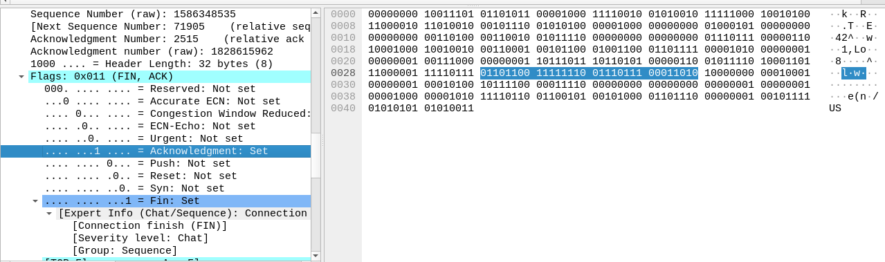

Wednesday Aug 28 2024

# Adding a connection terminate condition


an HTTPS connection can terminate in two ways:

- FIN (connection finished gracefully)
- RST (Reset, due to connection abruptly closing)


Both of them set flags in the network request.

Here's how fin and ACK are set:




Either it resets or it closes gracefully, we only care about flushing amount of data transferred when it shuts down to the database, hence:

```cpp
        if (tcp_flags & TH_FIN || tcp_flags & TH_RST) {
            // std::cout << (fwd_connection?"Forward":"Backward") << " connection ended for: " << src_ip << ":" << src_port << "->" << dst_ip << ":" << dst_port << std::endl;
            if(fwd_connection) {
                printConnectionInfo(src_ip, src_port, dst_ip, &db_manager);
                deleteConnectionInfo(src_ip, src_port, dst_ip);
            } else {
                printConnectionInfo(dst_ip, dst_port, src_ip, &db_manager);
                deleteConnectionInfo(dst_ip, dst_port, src_ip);
            }
        }
```

We print the connection information, when it closes while simeltaneously updating it in the database, and then we delete the connection information from the memory so it frees the memory for us.


I realized the code had reached about 350 lines, and it would only grow. So instead of having just one file, i decided to split it into multiple files.


Here's the project structure now:

```bash
.
├── build
│   ├── DatabaseManager.o
│   ├── main.o
│   ├── packet_analyzer
│   ├── PacketProcessor.o
│   └── Utils.o
├── DatabaseManager.cpp
├── DatabaseManager.h
├── issues.md
├── main.cpp
├── Makefile
├── manager
├── PacketProcessor.cpp
├── PacketProcessor.h
├── Utils.cpp
└── Utils.h

3 directories, 14 files
```

The makefile is made to make our compilation easier, i've set the compiler flags in it and added a build directory.

```bash
	┌─[root][THISPC][±][segregate ✓][~/ClientHello-Capture]
	└─▪  ./build/packet_analyzer 
	Usage: ./build/packet_analyzer <interface>
```
